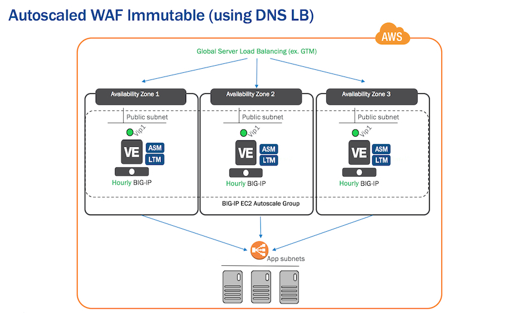

# AUTOSCALE BIGIP

## Description


This deployment in this branch consists of an Autoscaled Group of Big-IPs with Application Security Manager (ASM) using DNS to distribute traffic. 





### CloudFormation Templates

There are four CloudFormation templates in the /cfts directory:

* common.template - This template deploys common EC2/VPC resources which will be used by the other templates.  In particular, this template creates a VPC, subnets, a routing table, common security groups.
* application.template - This template deploys all components to support the application, with the exception of those related to BIG-IP.  An autoscaling group for the application is created, but we leave the creation of CloudWatch alarms and scaling policies as an exercise for the future. 
* autoscale-bigip.template - This template deploys an autoscaling group for utility instances BIG-IP. Example scaling policies and CloudWatch alarms are associated with the BIG-IP autoscaling group.
* ubuntu-client.template - Deploys an example test client (an ubuntu host) used for test traffic generation

Each of the other templates should only be deployed once for a given application deployment. 

### BIG-IP deployment and configuration

* All BIG-IPs are deployed with a single interface attached to a public subnet.
* Advanced traffic management functionality is provided through use of BIG-IP Local Traffic Manager (LTM). We use the Good 25Mbs image available in the AWS marketplace to license these modules.
* All BIG-IP configuration is performed at device bootup using CloudInit.  This can be seen in autoscale-bigip.template template. In general, CloudInit is used to :
  * set BIG-IP hostname, NTP, and DNS settings
  * change the default GUI port (to 8443)
  * add the aws-access-key and aws-secret-key to BIG-IP, allowing BIG-IP to make authenticated calls to AWS HTTPS endpoints.   
  * deploy integration with EC2 Autoscale and CloudWatch services for scaling of the BIG-IP tier.
  * create an https virtual server with uri-routing policy

## Usage

### Prerequisites

1) Access to Good Big-IP images in the Amazon region within which you are working.<br>
- Make sure that you have accepted the EULA for all Images in the AWS marketplace.<br>

2) Set of AWS Access Keys for use by BIG-IP, as described here:<br>
- https://support.f5.com/kb/en-us/products/big-ip_ltm/manuals/product/bigip-ve-setup-amazon-ec2-12-0-0/4.html#unique_1903231220<br>

3) OPTIONAL: Upload an SSL pfx certificate to an AWS S3 bucket or URL reachable by the Big-IP.

An example pfx certificate can be found at /bigip_files/ssl/website.pfx

Disclaimers: 

This is a self signed certificate so will cause the browser to report an error.

The more elegant way to install the certificate would be to source the file and use AWS::CloudFormation::Authentication: 
    

https://docs.aws.amazon.com/AWSCloudFormation/latest/UserGuide/aws-resource-authentication.html
```
ex.
          "config": {
            "files": {
              "/config/ssl/ssl.key/website.pfx":{
                "source":"https://s3.amazonaws.com/example/website.pfx",
                "mode": "000400",
                "owner": "root",
                "group": "root",
                "authentication" : "S3AccessCreds"
              },
```

Or build custom images with the certificates pre-installed.

https://support.f5.com/kb/en-us/products/big-ip_ltm/manuals/product/bigip-ve-autoscaling-amazon-ec2-12-1-0.html

However, using a little utility script to keep flexibility and dependencies down in example CFTs

