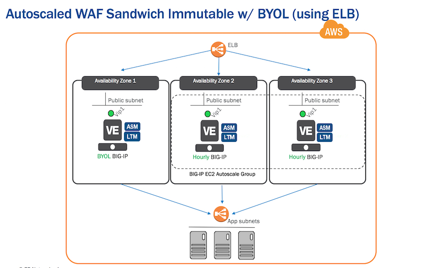

# AUTOSCALE BIGIP

## Description


This deployment in this branch consists of an Autoscaled Group of Big-IPs with Application Security Manager (ASM) using AWS's ELB to distribute traffic. 





### CloudFormation Templates

There are four CloudFormation templates in the /cfts directory:

* common.template - This template deploys common EC2/VPC resources which will be used by the other templates.  In particular, this template creates a VPC, subnets, a routing table, common security groups and an Elastic LoadBalancer (ELB) for the Autoscaled Big-IPs.
* application.template - This template deploys all components to support the application, with the exception of those related to BIG-IP.  An autoscaling group for the application is created, but we leave the creation of CloudWatch alarms and scaling policies as an exercise for the future. 
* autoscale-bigip.template - This template deploys an autoscaling group for utility instances BIG-IP. Example scaling policies and CloudWatch alarms are associated with the BIG-IP autoscaling group.
* byol-bigip.template - Deploys a single BYOL BIG-IP instance
* ubuntu-client.template - Deploys an example test client (an ubuntu host) used for test traffic generation

Each of the other templates should only be deployed once for a given application deployment. 

### BIG-IP deployment and configuration

* All BIG-IPs are deployed with a single interface attached to a public subnet.
* Advanced traffic management functionality is provided through use of BIG-IP Local Traffic Manager (LTM). We use the Good 25Mbs image available in the AWS marketplace to license these modules.
* All BIG-IP configuration is performed at device bootup using CloudInit.  This can be seen in autoscale-bigip.template template. In general, CloudInit is used to :
  * set BIG-IP hostname, NTP, and DNS settings
  * add aws-access-key and aws-secret-key to BIG-IP, allowing BIG-IP to make authenticated calls to AWS HTTPS endpoints.   
  * create an http virtual server with a waf policy
  * deploy integration with EC2 Autoscale and CloudWatch services for scaling of BIG-IP tier.


## Usage

### Prerequisites

1) Access to Good Big-IP images in the Amazon region within which you are working.<br>
- Make sure that you have accepted the EULA for all Images in the AWS marketplace.<br>

2) Set of AWS Access Keys for use by BIG-IP, as described here:<br>
- https://support.f5.com/kb/en-us/products/big-ip_ltm/manuals/product/bigip-ve-setup-amazon-ec2-12-0-0/4.html#unique_1903231220<br>

3) Upload SSL certificate to AWS

http://docs.aws.amazon.com/cli/latest/reference/iam/upload-server-certificate.html

For example: a sample certificate has been included in the /bigip_files/ssl directory:

```
From top of repository:

>cd bigip_files/ssl
>aws iam upload-server-certificate --server-certificate-name example-website --certificate-body file://website.crt --private-key file://website.key --certificate-chain file://ca-bundle.crt
{
    "ServerCertificateMetadata": {
        "ServerCertificateId": "ASCAJTBEHBCYXXX24JNJS",
        "ServerCertificateName": "f5example-cert",
        "Expiration": "2021-04-09T20:16:23Z",
        "Path": "/",
        "Arn": "arn:aws:iam::XXXXXXXXXXXX:server-certificate/f5example-cert",
        "UploadDate": "2016-06-30T21:52:46.448Z"
    }
}
```

Note the "Arn". You will use this as input to the CFT or configuration file (see below)
Disclaimer: This is a self signed certificate so will cause the browser to report an error.

